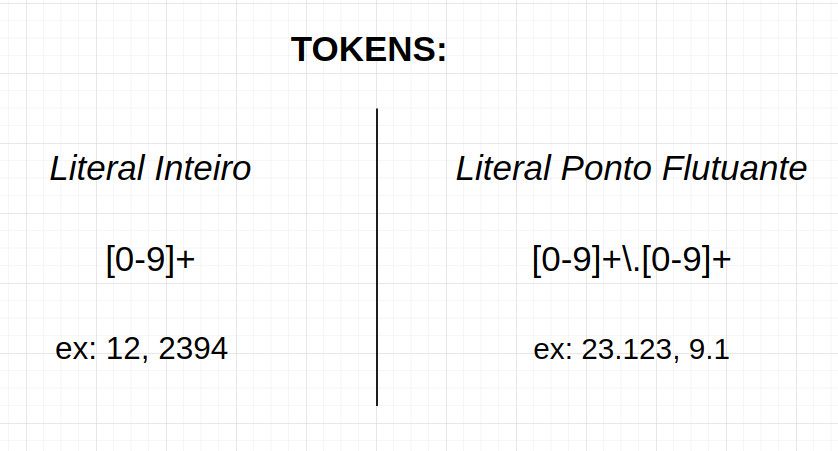
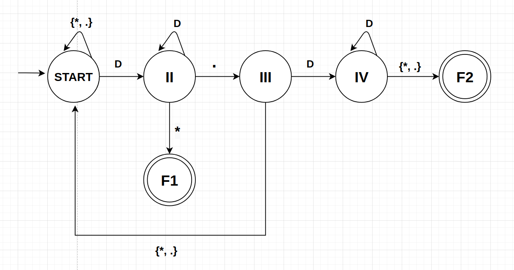

# A finite automata for recognizing numbers

## Autômato finito para o reconhecimento de números

Este programa foi feito como parte de um trabalho para a disciplina de Príncipios e Paradigmas de Linguagens de Programação. Nele mostramos como é o processo de construção de um programa que reconhece padrões dentro de uma sequência de caracteres, que é justamente o trabalho do analisador léxico. 
 	Primeiramente devemos escolher os tokens que queremos identificar: Literal Inteiro e Literal Ponto Flutuante. Em seguida definimos, com a ajuda das expressões regulares, como é o padrão desses dois tipos numéricos. 
  
  Então, devemos converter as expressões em um único autômato finito determinístico que é capaz de identificar esses padrões dentro de uma string de entrada. Por fim, basta representar o autômato em forma de código.
  
	Teremos um arquivo que guarda a nossa sequência de caracteres com alguns números dentro. Foi contruida uma função chamada getNextNumber, que é responsavel por toda a mágica e retorna o próximo token numérico encontrado dentro da string.
	Para converter o autômato em código criamos um enum para enumerar cada um dos possíveis estados e uma variável para guardar o estado atual. Construimos funções para representar cada transição de estado. Essas funções recebem um caractere lido do arquivo e o seu tipo, e retornam qual será o próximo estado do autômato após a leitura do caracter.
	Como nós estamos reconhecendo apenas inteiros e decimais sabemos que o alfabeto de entrada será {0, 1, 2, 3, 4, 5, 6, 7, 8, 9, .}. Para simplificar o autômato foi implementada uma função (getCharType) que retorna o tipo do caractere que acabou de ser lido do arquivo. Baseado no alfabeto de entrada podemos definir esses possíveis tipos como sendo: D (Dígito), . (ponto) e * (outro). Desta forma teremos uma função de transição que é ativada com um dígito (caratere do tipo == D), ao invés de termos 10 diferentes funções, uma para cada caratere dígito, por exemplo.
	Foi usado um ponteiro para char para salvar os carateres que estão passando pelo autômato. Caso uma substring seja identificada como um token válido ela já estará guardada nesse ponteiro. Nosso ponteiro suporta um número de até 100 caracteres.
	Sabendo de todas essas informações podemos agora descrever a lógica por trás da função mais importante do programa, a getNextNumber. Primeiro definimos o estado atual do autômato como sendo START (início). Lemos um caratere do arquivo e identificamos o seu tipo com a função getCharType. Verificamos o estado atual do autômato com um switch case, e então chamamos a função de transição referente aquele estado passando o caractere lido, o seu tipo e o ponteiro que salva os caracteres que passam pela nossa máquina de estados. O retorno dessa função (o próximo estado do autômato) é guardado na nossa variável de estado atual, a state. Depois disso o próximo caractere do arquivo é lido e o processo se repete. Quando uma das funções de transição retornar um estado final (F1 ou F2) saimos da função getNextNumber retornando 0, porque o autômato pôde identificar o próximo token numérico. Caso a getNextNumber for chamada e não houver mais tokens no arquivo ela retornará -1.
